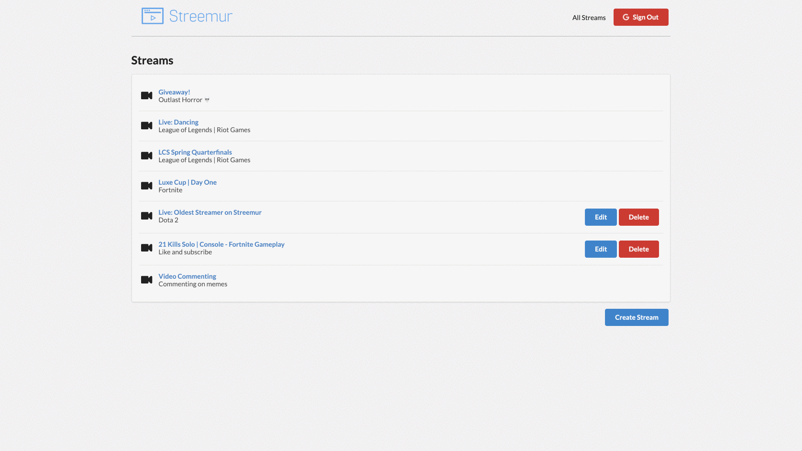

<!-- PROJECT SHIELDS -->

[![Contributors][contributors-shield]]()
[![LinkedIn][linkedin-shield]][linkedin-url]

<!-- PROJECT LOGO -->
<br />
<p align="center">
  <a href="https://github.com/rsokz/streemur">
    
  </a>

  <h3 align="center">Streemur</h3>

  <p align="center">
    Stream live video to a personal channel (gaming, tutorials, q&a, etc).
    <br />
    <a href="https://github.com/rsokz/awesome-dashboard"><strong>View Demo »</strong></a>
  </p>
</p>

## About The Project



Streemur React app is a live streaming video platform. The app allows users to create a variety of live video content (video game streaming, broadcasts of eSports competitions, music broadcasts, creative content, etc). Streams are created using OBS software.

## Features

> dev features

- Fully TypeScript React Client
- Redux
- [RTMP Media Server](https://github.com/illuspas/Node-Media-Server)
- Node Server (JSON)
- Semantic UI

> user features

- Authenticate with Google
- Create a new stream
- Edit / delete streams
- Stream live video using [OBS (Open Broadcast Software)](https://obsproject.com/)

## Getting Started

### Installation

> Clone

```sh
git clone https://github.com/rsokz/streemur
```

> Start server

```sh
cd server
yarn
yarn start
```

> Start RTMP server:

```sh
cd rtmpserver
yarn
yarn start
```

> Start client:

```sh
cd client
yarn
yarn start
```

### Usage

> Start streaming with OBS:

1. Open OBS software
2. Open settings & update "Stream" settings
3. Set "Server" to `rtmp://localhost/live`
4. Create a new stream on the app
5. Set "Stream Key" to the `id` portion of your created stream url
6. Start streaming

## Built With

## To-Do (v2)

- [ ] Connect to a DB

<!-- MARKDOWN LINKS & IMAGES -->

[contributors-shield]: https://img.shields.io/badge/contributors-1-orange.svg?style=flat-square
[linkedin-shield]: https://img.shields.io/badge/-LinkedIn-black.svg?style=flat-square&logo=linkedin&colorB=555
[linkedin-url]: https://linkedin.com/in/rsokz
